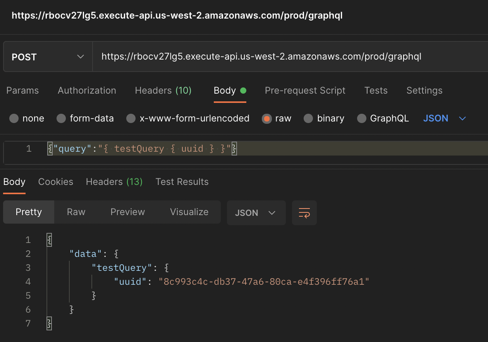

# api-gateway-cdk-graphql-test

Test project to assess how hard it would be to setup a fully serverless GraphQL server using [graphql-go](https://github.com/graph-gophers/graphql-go) and [AWS CDK](https://aws.amazon.com/cdk/).

This package is largely adapted from [tonyghita/graphql-go-example](https://github.com/tonyghita/graphql-go-example). You should check out their project for a more in depth example.

I wrote this to satisfy my own curiosity, don't use this in production.

## How it works

It uses the AWS API Gateway to send raw HTTP requests to a lambda. You get the benefit of API Gateway/Lambda's infinite scalability/zero-infra, with the benefit of building your own GraphQL resolvers in Go.

The related infra to make this example work lives inside [cdk](cdk), which stores the CDK required to deploy this project.

If you want to put this on a custom domain, you could with a few options, such as using a Cloudfront distribution. I haven't done it in this example.

## Example request

Once you deploy the stacks, you can make the following request to see it in action! (note, the API gateway instance in the screenshot has been deleted, therefore will not work).

